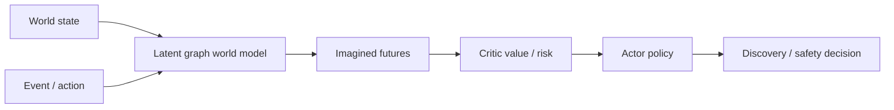

# wm-agent

**Sub-millisecond foresight via typed world models** — imagine, score, and rank counterfactual futures through one shared `imagine / score / search` contract verified across two physical domains.


## What it does

```text
state -> imagine candidate futures -> score risk -> rank events
```

wm-agent trains a latent dynamics model on observed trajectories, then uses
the frozen model to roll counterfactual futures forward under candidate
events. An actor / critic agent ranks those futures for **high-risk
discovery** (red-team scenario testing) or **low-risk planning**
(risk-averse decisions). The same loop is verified on two domains:

| Domain | World model | Used as |
|---|---|---|
| Power-grid EMT (CloudPSS IEEE-39) | learned latent graph dynamics | high-fidelity industrial physics oracle |
| CartPole control | analytic Euler dynamics | sanity check that the contract is domain-portable |

The system is built around a small typed contract — `WorldState`,
`WorldEvent`, `ImaginedFuture`, `RiskSignal`, `search()` — so plugging in a
third domain is one adapter, not a rewrite.

## Key results

Agent benchmark on the power-grid case study, evaluated on held-out
trajectories (anchors the agent never saw at training time):

| Metric | Value |
|---|---|
| Discover top-10% risky candidate (hit rate) | **0.75** |
| Risk lift over random | **+102 %** |
| Strict OOD risk lift on an unseen fault family | **+27 %** |
| Inference latency | **0.17 ms / state** (~3,800× faster than exhaustive rollout) |

Random baseline hit rate ≈ 0.10. Strict OOD here means the agent's actor
and critic were trained without ever observing the held-out fault family.

## API in 10 lines

```python
from wmagent.world.power_grid import PowerGridWorldModelSystem

world = PowerGridWorldModelSystem.from_run_dir("outputs/run_3acec7d14d")
state  = world.anchor_state(split="val", anchor_index=0, horizon=10)
events = world.candidate_events(horizon=10)

future = world.imagine(state, events[0])
risk   = world.score(future)
top    = world.search(state, events, top_k=10)
```

The same `imagine / score / search` contract runs on the
[CartPole adapter](examples/cartpole_failure_foresight/main.py) with no
changes to the agent or evaluation code.

## Architecture



## Quickstart

```bash
git clone https://github.com/zcyyyds-test/wmagent.git
cd wmagent
pip install -e ".[dev]"
pytest -q
python scripts/rank_scenarios.py outputs/run_3acec7d14d --top-k 10
```

For the live HTTP API:

```bash
pip install -e ".[serve]"
python scripts/serve_api.py --run-dir outputs/run_3acec7d14d
curl localhost:8000/health
```

## Project map

- `wmagent/` — Python package.
  - `wmagent/world/base.py` — the typed `imagine / score / search` contract.
  - `wmagent/world/power_grid.py` — power-grid adapter.
  - `wmagent/world/cartpole.py` — CartPole adapter (no learned model; analytic dynamics).
  - `wmagent/agent/` — Dreamer-style actor / critic agent.
  - `wmagent/serve/api.py` — FastAPI surface for online inference.
- `scripts/` — training, evaluation, scenario search, online serving.
- `examples/` — runnable smoke scripts per domain.
- `experiments/` — agent benchmark and baseline comparison artifacts.
- `docs/world_model_playground.html` — static interactive demo of the
  imagined-rollout loop.

## License

MIT.
