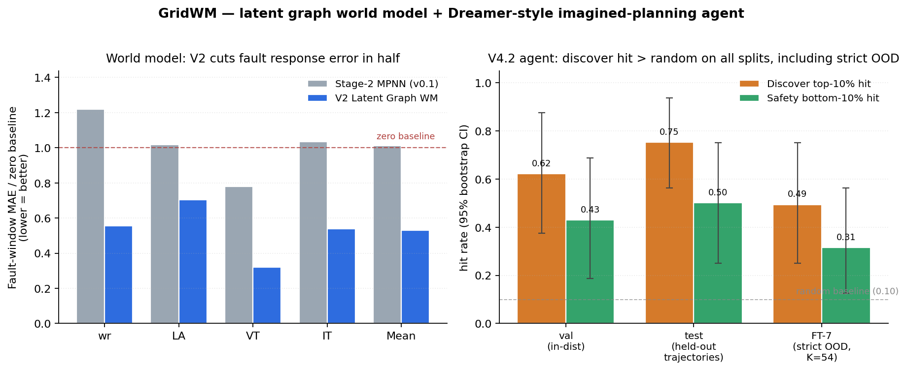
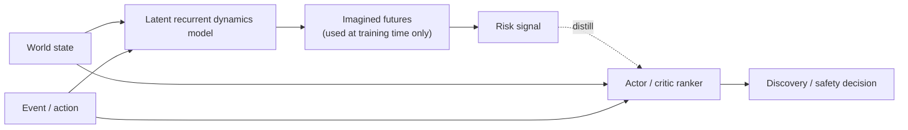

# gridwm-agent

**World-model-distilled risk-ranking agent for sub-millisecond *ranker inference* over candidate fault events on power-grid EMT.** A learned latent dynamics model imagines counterfactual fault rollouts offline; an actor-critic ranker is then distilled against those imagined-future risk labels and predicts at inference which candidate fault is most/least dangerous in microseconds, without invoking the world model at inference. The 0.17 ms/state figure below is the *ranker* forward pass; running the world model itself across all 162 candidates per anchor takes hundreds of milliseconds (reported in `experiments/agent_benchmark/`). Verified on a CloudPSS IEEE-39 case study and on a CartPole contract-portability adapter.



## What it does

```text
state -> imagine candidate futures -> score risk -> rank events
```

`gridwm-agent` trains a deterministic latent recurrent dynamics model
(no stochastic posterior; not RSSM-style) on observed CloudPSS
trajectories, then uses the frozen model to roll counterfactual futures
forward under candidate fault events. A small actor-critic agent is trained offline on
those imagined-future risk labels and learns to rank events directly from
`(state, event)` — at inference the agent does **not** call the world model.
The same loop runs on two domains:

| Domain | Dynamics model | Used as |
|---|---|---|
| Power-grid EMT (CloudPSS IEEE-39) | learned 10-generator latent recurrent dynamics | EMT simulation oracle |
| CartPole control | analytic Euler dynamics (no learned model) | sanity check that the contract is domain-portable |

The system is built around a small typed contract — `WorldState`,
`WorldEvent`, `ImaginedFuture`, `RiskSignal`, `search()` — so plugging in a
third domain is one adapter, not a rewrite.

## Key results

Agent benchmark on the power-grid case study, on held-out trajectory anchors
the agent never saw during training. `n_anchors = 16` per split, 162 candidate
fault events per anchor, 1000-resample bootstrap on each metric.

| Metric | Test point | Test 95% CI | Val point | Val 95% CI |
|---|---:|---:|---:|---:|
| Discover top-10% hit rate | **0.75** | [0.56, 0.94] | 0.62 | [0.38, 0.88] |
| Safe bottom-10% hit rate | 0.50 | [0.25, 0.75] | 0.43 | [0.19, 0.69] |
| Critic Pearson on imagined risk | 0.67 | — | 0.64 | — |
| Agent inference latency | **0.17 ms / state** (Intel single GPU) |
| FT-7-only candidate-space evaluation, hit rate | 0.50 | — | — | — |

Random baseline hit rate ≈ 0.10. The "FT-7-only candidate-space evaluation"
(referred to in older artefacts as "strict OOD") is described under
[Caveats](#caveats) — it is not end-to-end OOD.

## API in 10 lines

```python
from pathlib import Path
from wmagent.world.power_grid import PowerGridWorldModelSystem

world = PowerGridWorldModelSystem.from_run_dir(Path("outputs/demo_run"))
state  = world.anchor_state(split="val", anchor_index=0, horizon=10)
events = world.candidate_events(horizon=10)

future = world.imagine(state, events[0])
risk   = world.score(future)
top    = world.search(state, events, top_k=10)   # brute-force argsort over `events`
```

The same `imagine / score / search` contract runs on the
[CartPole adapter](examples/cartpole_failure_foresight/main.py) with no
changes to the agent or evaluation code.

`search()` here is exhaustive ranking over the supplied candidate set, not a
tree/beam/MCTS search. For the IEEE-39 case study the candidate set is a
fixed 162-event vocabulary.

## Architecture



## Quickstart

```bash
git clone https://github.com/zcyyyds-test/gridwm-agent.git
cd gridwm-agent
pip install -e ".[dev]"
pytest -q

# Rank candidate fault events against the bundled demo checkpoint
python scripts/rank_scenarios.py outputs/demo_run --top-k 10
```

The bundled `outputs/demo_run/` (≈8 MB) contains the V2-stage frozen world
model (`best.pt`) and the V4.2-stage actor-critic ranker (`agent.pt`) used
for the benchmark numbers above, plus a small (~25 KB) `anchors.pt` cache
of pre-built anchor states. With that cache present, the quickstart runs
without `data/raw/`; for arbitrary anchors outside the cached set you do
need to re-collect the dataset (see Data section below).

For the live HTTP API:

```bash
pip install -e ".[serve]"
python scripts/serve_api.py --run-dir outputs/demo_run
curl localhost:8000/health
```

The HTTP API is localhost-only and unauthenticated; do not bind to a routable
address without an upstream reverse proxy that handles auth and rate-limiting.

## Caveats

These limitations matter; please read before using benchmark numbers as
evidence of stronger claims:

- **Graph topology is a placeholder.** `data/graph_ieee39.h5` has fully-connected
  10-generator adjacency with `node_attr` and `edge_attr` set to zero. The
  trained model has graph message-passing layers but no IEEE-39 electrical prior
  on edges or nodes — see the warning in `scripts/build_placeholder_topology.py`.
  All numbers above were trained against this placeholder graph.
- **The agent is offline-distilled, not Dreamer-style RL.** The agent is an
  actor-critic MLP trained against pre-computed risk labels generated from a
  frozen world model. There is no in-the-loop latent imagination, no RSSM, no
  KL / ELBO. Calling this "Dreamer-style" would be inaccurate; we describe it
  as world-model-distilled ranking.
- **`search()` is exhaustive ranking.** Given `K` candidate events it imagines
  all `K` futures and `argsort`s them. No pruning, no beam, no MCTS. For
  larger candidate spaces this would need a real search procedure.
- **"FT-7-only candidate-space evaluation" is not end-to-end OOD.** The agent's
  actor and critic are trained with FT-7 candidates excluded, but the
  underlying world model is trained on a random 80/10/10 trajectory split that
  does include FT-7 fault-type trajectories. So the agent has not been trained
  on FT-7 candidates; the world model has.
- **n_anchors = 16.** Bootstrap CIs above are wide. Treat point estimates as
  indicative, not as production accuracy.
- **`outputs/demo_run` bundles the V2 world model + V4.2 ranker.** Convenient
  for a one-command demo; for serious use, retrain on your own data using
  the scripts in `scripts/`.
- **Inference latency is for the agent only.** It is the time for a forward
  pass through the actor-critic MLP, not for invoking the world model. The
  per-anchor cost of running the world model itself over 162 candidates is
  hundreds of milliseconds and is reported in `experiments/agent_benchmark/`
  for transparency.

## Data

The repo does **not** ship the 1.3 GB of CloudPSS-derived raw HDF5
trajectories used for training. They are subject to CloudPSS's terms of
use and too large to clone routinely. The bundled `outputs/demo_run/`
checkpoint already encodes everything the README quickstart needs.

To regenerate the dataset:

1. Configure CloudPSS credentials in your shell environment
   (`CLOUDPSS_TOKEN` or `CLOUDPSS_USERNAME` / `CLOUDPSS_PASSWORD`, plus
   `GRIDWM_IEEE39_RID`).
2. Run `python scripts/collect_data.py`. See `docs/cloudpss_pipeline.md`
   for the SDK call chain and EMT settings used.
3. Run `python scripts/compute_norm_stats.py` to refresh
   `data/norm_stats.json`.

`data/graph_ieee39.h5` is committed because it is small and required at
import time. Note: it is a **placeholder fully-connected zero-feature
graph**, not a real IEEE-39 topology — see [Caveats](#caveats).

## Project map

- `wmagent/` — Python package.
  - `wmagent/world/base.py` — the typed `imagine / score / search` contract.
  - `wmagent/world/power_grid.py` — power-grid adapter.
  - `wmagent/world/cartpole.py` — CartPole adapter (no learned model; analytic dynamics).
  - `wmagent/agent/` — actor / critic ranker (`WorldModelDistilledRanker`).
  - `wmagent/serve/api.py` — FastAPI surface for online inference.
- `scripts/` — training, evaluation, scenario search, online serving.
- `examples/` — runnable smoke scripts per domain.
- `experiments/` — agent benchmark and baseline comparison artifacts.
- `docs/world_model_playground.html` — static interactive demo of the
  imagined-rollout loop.

## License

MIT.
